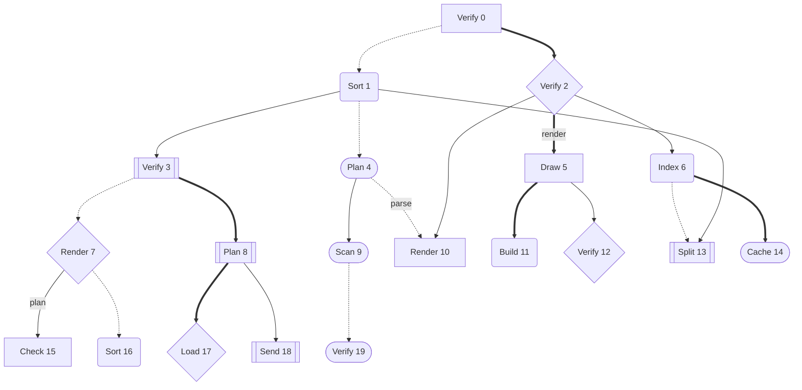
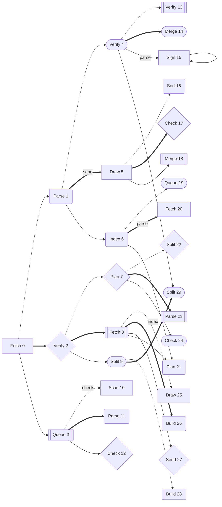
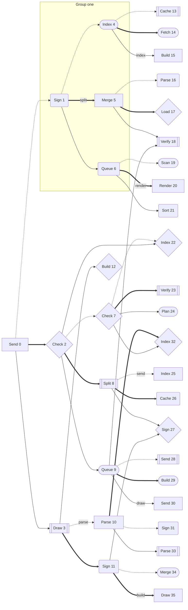
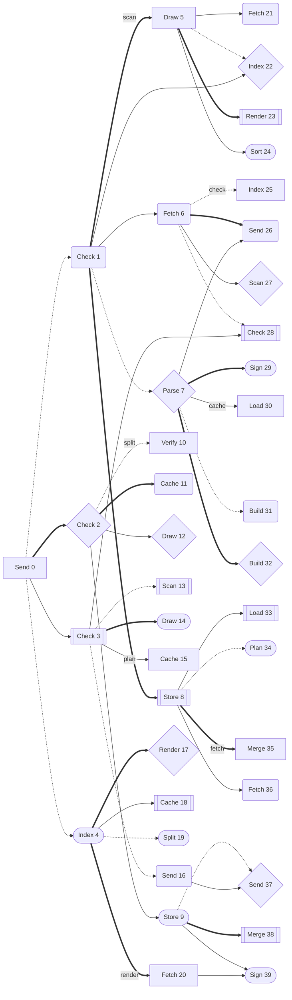
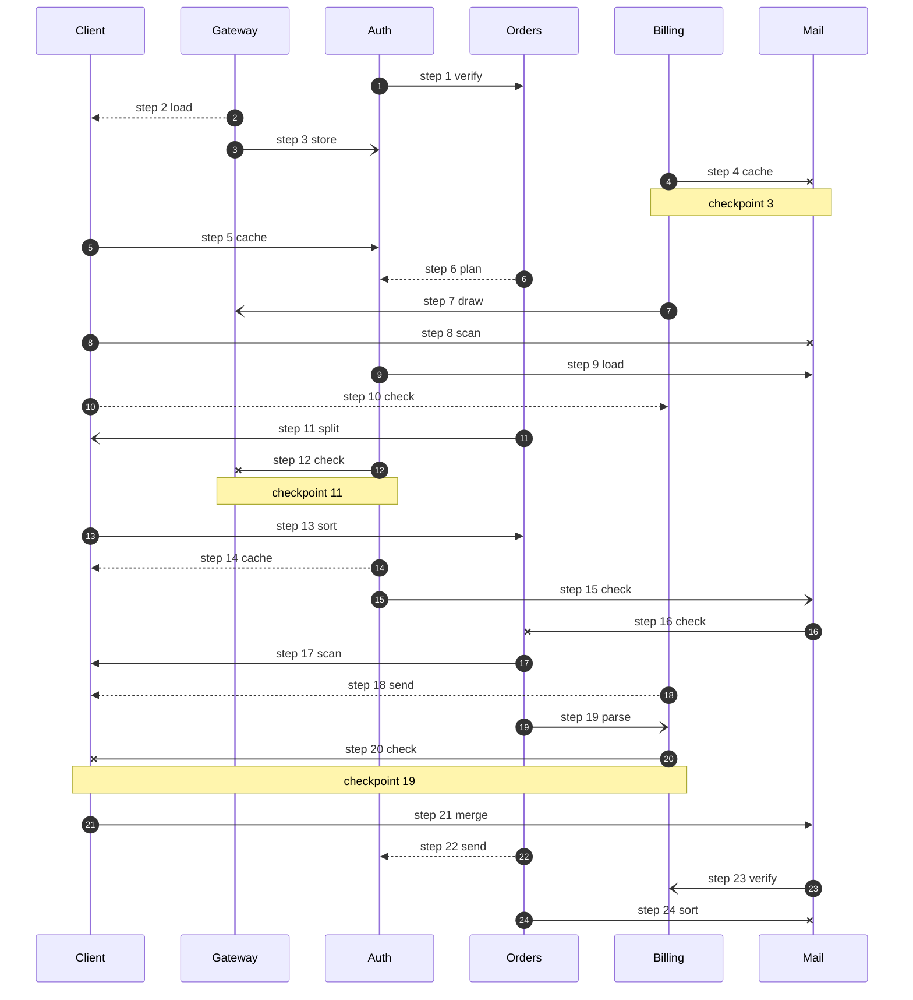

# Mermaid heavy

Five larger diagrams (20–40 nodes).

## Flowchart 1

```mermaid
flowchart TD
  n0[Verify 0]
  n1(Sort 1)
  n2{Verify 2}
  n3[[Verify 3]]
  n4([Plan 4])
  n5[Draw 5]
  n6(Index 6)
  n7{Render 7}
  n8[[Plan 8]]
  n9([Scan 9])
  n10[Render 10]
  n11(Build 11)
  n12{Verify 12}
  n13[[Split 13]]
  n14([Cache 14])
  n15[Check 15]
  n16(Sort 16)
  n17{Load 17}
  n18[[Send 18]]
  n19([Verify 19])
  n0 -.-> n1
  n0 ==> n2
  n1 --> n3
  n1 -.-> n4
  n2 ==>|render| n5
  n2 --> n6
  n3 -.-> n7
  n3 ==> n8
  n4 --> n9
  n4 -.->|parse| n10
  n5 ==> n11
  n5 --> n12
  n6 -.-> n13
  n6 ==> n14
  n7 -->|plan| n15
  n7 -.-> n16
  n8 ==> n17
  n8 --> n18
  n9 -.-> n19
  n2 --> n10
  n1 --> n13
```

## Flowchart 2

```mermaid
flowchart LR
  n0[Fetch 0]
  n1(Parse 1)
  n2{Verify 2}
  n3[[Queue 3]]
  n4([Verify 4])
  n5[Draw 5]
  n6(Index 6)
  n7{Plan 7}
  n8[[Fetch 8]]
  n9([Split 9])
  n10[Scan 10]
  n11(Parse 11)
  n12{Check 12}
  n13[[Verify 13]]
  n14([Merge 14])
  n15[Sign 15]
  n16(Sort 16)
  n17{Check 17}
  n18[[Merge 18]]
  n19([Queue 19])
  n20[Fetch 20]
  n21(Plan 21)
  n22{Split 22}
  n23[[Parse 23]]
  n24([Check 24])
  n25[Draw 25]
  n26(Build 26)
  n27{Send 27}
  n28[[Build 28]]
  n29([Split 29])
  n0 -.-> n1
  n0 ==> n2
  n0 --> n3
  n1 -.-> n4
  n1 ==>|send| n5
  n1 --> n6
  n2 -.-> n7
  n2 ==> n8
  n2 --> n9
  n3 -.->|check| n10
  n3 ==> n11
  n3 --> n12
  n4 -.-> n13
  n4 ==> n14
  n4 -->|parse| n15
  n5 -.-> n16
  n5 ==> n17
  n5 --> n18
  n6 -.-> n19
  n6 ==>|parse| n20
  n6 --> n21
  n7 -.-> n22
  n7 ==> n23
  n7 --> n24
  n8 -.->|index| n25
  n8 ==> n26
  n8 --> n27
  n9 -.-> n28
  n9 ==> n29
  n4 --> n29
  n15 --> n15
  n8 --> n21
```

## Flowchart 3

```mermaid
flowchart LR
  n0[Send 0]
  n1(Sign 1)
  n2{Check 2}
  n3[[Draw 3]]
  n4([Index 4])
  n5[Merge 5]
  n6(Queue 6)
  n7{Check 7}
  n8[[Split 8]]
  n9([Queue 9])
  n10[Parse 10]
  n11(Sign 11)
  n12{Build 12}
  n13[[Cache 13]]
  n14([Fetch 14])
  n15[Build 15]
  n16(Parse 16)
  n17{Load 17}
  n18[[Verify 18]]
  n19([Scan 19])
  n20[Render 20]
  n21(Sort 21)
  n22{Index 22}
  n23[[Verify 23]]
  n24([Plan 24])
  n25[Index 25]
  n26(Cache 26)
  n27{Sign 27}
  n28[[Send 28]]
  n29([Build 29])
  n30[Send 30]
  n31(Sign 31)
  n32{Index 32}
  n33[[Parse 33]]
  n34([Merge 34])
  n35[Draw 35]
  n0 -.-> n1
  n0 ==> n2
  n0 --> n3
  n1 -.-> n4
  n1 ==>|split| n5
  n1 --> n6
  n2 -.-> n7
  n2 ==> n8
  n2 --> n9
  n3 -.->|parse| n10
  n3 ==> n11
  n3 --> n12
  n4 -.-> n13
  n4 ==> n14
  n4 -->|index| n15
  n5 -.-> n16
  n5 ==> n17
  n5 --> n18
  n6 -.-> n19
  n6 ==>|render| n20
  n6 --> n21
  n7 -.-> n22
  n7 ==> n23
  n7 --> n24
  n8 -.->|send| n25
  n8 ==> n26
  n8 --> n27
  n9 -.-> n28
  n9 ==> n29
  n9 -->|draw| n30
  n10 -.-> n31
  n10 ==> n32
  n10 --> n33
  n11 -.-> n34
  n11 ==>|build| n35
  n2 --> n22
  n7 --> n32
  n9 --> n18
  n11 --> n27
  subgraph g1 [Group one]
    n1
    n4
    n5
    n6
  end
```

## Flowchart 4

```mermaid
flowchart LR
  n0[Send 0]
  n1(Check 1)
  n2{Check 2}
  n3[[Check 3]]
  n4([Index 4])
  n5[Draw 5]
  n6(Fetch 6)
  n7{Parse 7}
  n8[[Store 8]]
  n9([Store 9])
  n10[Verify 10]
  n11(Cache 11)
  n12{Draw 12}
  n13[[Scan 13]]
  n14([Draw 14])
  n15[Cache 15]
  n16(Send 16)
  n17{Render 17}
  n18[[Cache 18]]
  n19([Split 19])
  n20[Fetch 20]
  n21(Fetch 21)
  n22{Index 22}
  n23[[Render 23]]
  n24([Sort 24])
  n25[Index 25]
  n26(Send 26)
  n27{Scan 27}
  n28[[Check 28]]
  n29([Sign 29])
  n30[Load 30]
  n31(Build 31)
  n32{Build 32}
  n33[[Load 33]]
  n34([Plan 34])
  n35[Merge 35]
  n36(Fetch 36)
  n37{Send 37}
  n38[[Merge 38]]
  n39([Sign 39])
  n0 -.-> n1
  n0 ==> n2
  n0 --> n3
  n0 -.-> n4
  n1 ==>|scan| n5
  n1 --> n6
  n1 -.-> n7
  n1 ==> n8
  n2 --> n9
  n2 -.->|split| n10
  n2 ==> n11
  n2 --> n12
  n3 -.-> n13
  n3 ==> n14
  n3 -->|plan| n15
  n3 -.-> n16
  n4 ==> n17
  n4 --> n18
  n4 -.-> n19
  n4 ==>|render| n20
  n5 --> n21
  n5 -.-> n22
  n5 ==> n23
  n5 --> n24
  n6 -.->|check| n25
  n6 ==> n26
  n6 --> n27
  n6 -.-> n28
  n7 ==> n29
  n7 -->|cache| n30
  n7 -.-> n31
  n7 ==> n32
  n8 --> n33
  n8 -.-> n34
  n8 ==>|fetch| n35
  n8 --> n36
  n9 -.-> n37
  n9 ==> n38
  n9 --> n39
  n16 --> n37
  n20 --> n39
  n3 --> n28
  n7 --> n26
  n1 --> n22
```

## Sequence

```mermaid
sequenceDiagram
  autonumber
  participant Client
  participant Gateway
  participant Auth
  participant Orders
  participant Billing
  participant Mail
  Auth->>Orders: step 1 verify
  Gateway-->>Client: step 2 load
  Gateway-)Auth: step 3 store
  Billing-xMail: step 4 cache
  Note over Billing,Mail: checkpoint 3
  Client->>Auth: step 5 cache
  Orders-->>Auth: step 6 plan
  Billing-)Gateway: step 7 draw
  Client-xMail: step 8 scan
  Auth->>Mail: step 9 load
  Client-->>Billing: step 10 check
  Orders-)Client: step 11 split
  Auth-xGateway: step 12 check
  Note over Auth,Gateway: checkpoint 11
  Client->>Orders: step 13 sort
  Auth-->>Client: step 14 cache
  Auth-)Mail: step 15 check
  Mail-xOrders: step 16 check
  Orders->>Client: step 17 scan
  Billing-->>Client: step 18 send
  Orders-)Billing: step 19 parse
  Billing-xClient: step 20 check
  Note over Billing,Client: checkpoint 19
  Client->>Mail: step 21 merge
  Orders-->>Auth: step 22 send
  Mail-)Billing: step 23 verify
  Orders-xMail: step 24 sort
```
