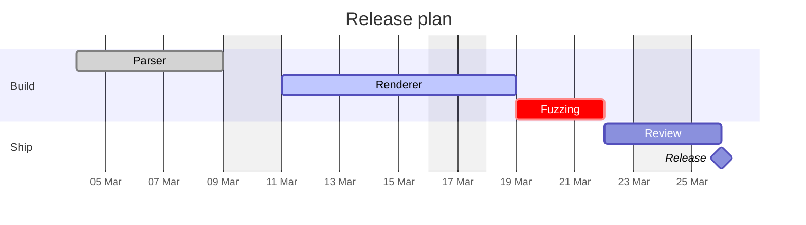
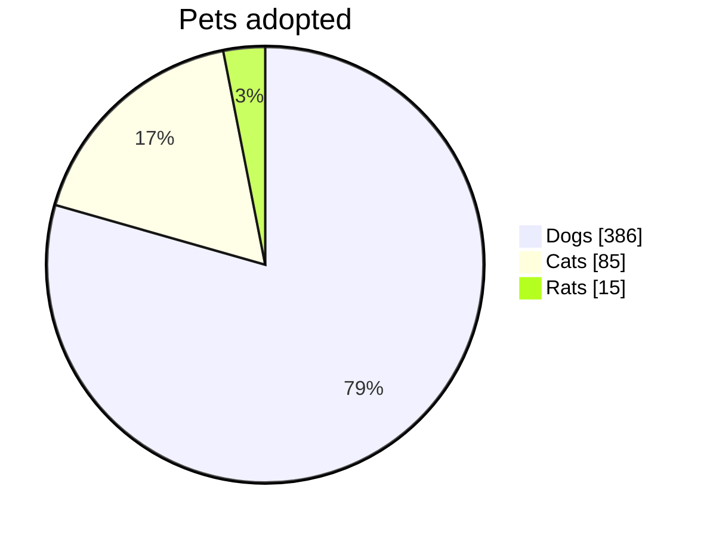

# Plan

```mermaid
gantt
  title Release plan
  dateFormat YYYY-MM-DD
  axisFormat %d %b
  excludes weekends
  section Build
  Parser      :done, p1, 2024-03-04, 5d
  Renderer    :active, r1, after p1, 6d
  Fuzzing     :crit, f1, after r1, 3d
  section Ship
  Review      :rv, after f1, 2d
  Release     :milestone, after rv, 0d
```

```mermaid
pie showData title Pets adopted
  "Dogs" : 386
  "Cats" : 85
  "Rats" : 15
```
