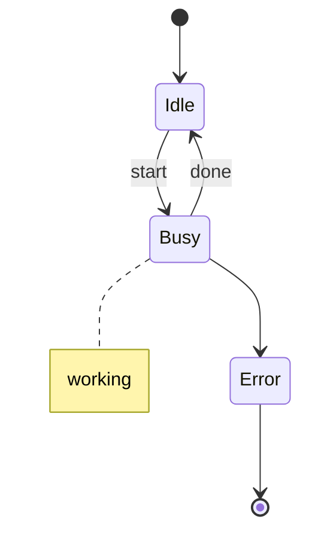
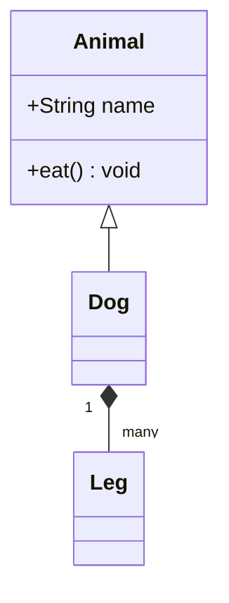
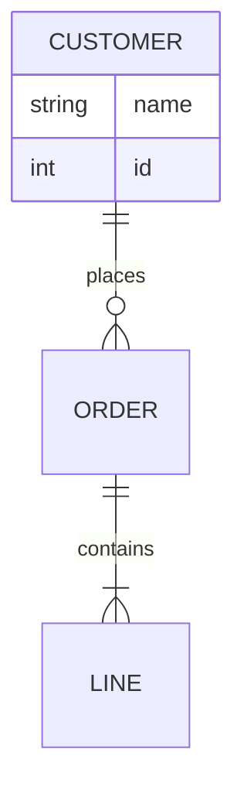
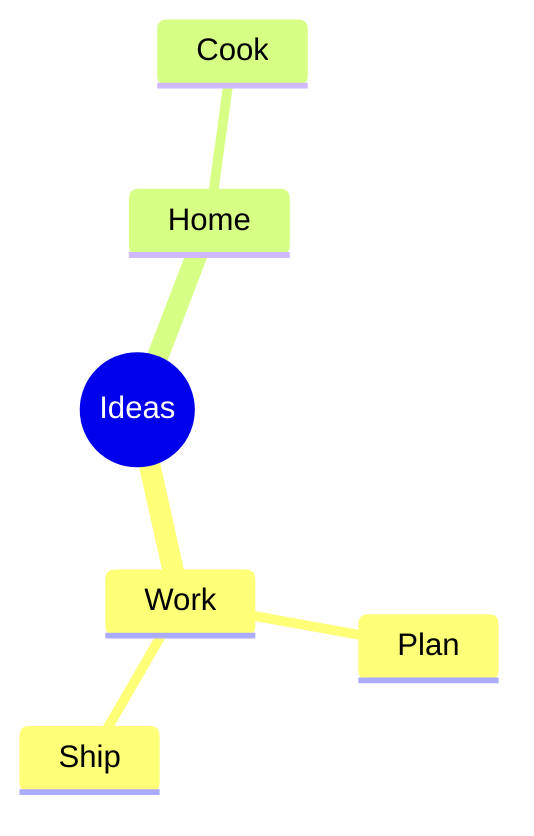

# Models

```mermaid
stateDiagram-v2
  [*] --> Idle
  Idle --> Busy : start
  Busy --> Idle : done
  Busy --> Error
  Error --> [*]
  note right of Busy : working
```

```mermaid
classDiagram
  class Animal {
    +String name
    +eat() void
  }
  class Dog
  Animal <|-- Dog
  Dog "1" *-- "many" Leg
```

```mermaid
erDiagram
  CUSTOMER ||--o{ ORDER : places
  ORDER ||--|{ LINE : contains
  CUSTOMER {
    string name
    int id
  }
```

```mermaid
mindmap
  root((Ideas))
    Work
      Plan
      Ship
    Home
      Cook
```
