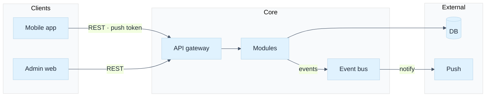

# Mermaid init theme under the dark UI

F-44 / F-45 / F-46 (prompt 020 §5.0): a `%%{init}%%` light theme with edge labels, and sibling subgraphs.

```mermaid
%%{init: {'theme':'base', 'themeVariables': {'primaryColor':'#E0F2FE', 'primaryTextColor':'#1F2937', 'lineColor':'#475569', 'tertiaryColor':'#F8FAFC'}}}%%
flowchart LR
subgraph CL[Clients]
MOB[Mobile app]
WEB[Admin web]
end
subgraph CORE[Core]
GW[API gateway]
MOD[Modules]
BUS[Event bus]
end
subgraph EXT[External]
DB[(DB)]
P[Push]
end
MOB -->|REST · push token| GW
WEB -->|REST| GW
GW --> MOD
MOD -->|events| BUS
MOD --> DB
BUS -->|notify| P
```
