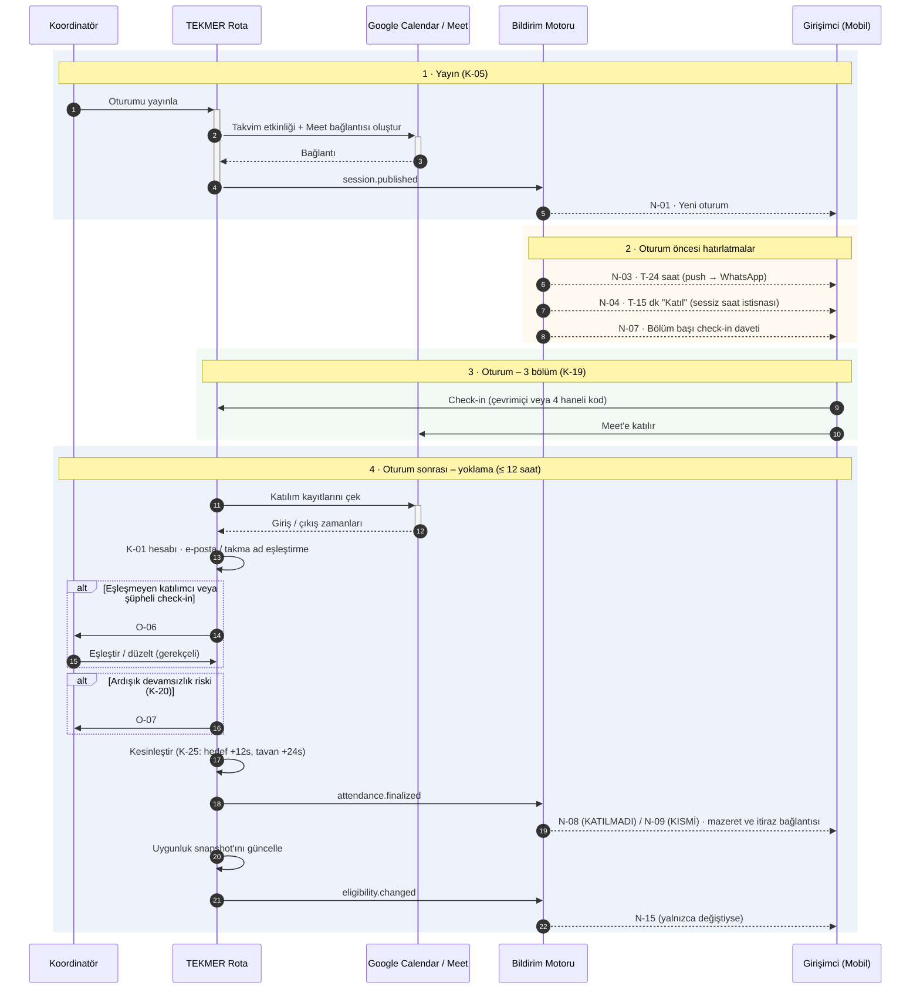

# Mermaid sequence diagram with `rect` bands (owner example, prompt 023)

Transcribed from the owner's screenshot (lines 4–51); lines 1–3 are assumed.

```mermaid
sequenceDiagram
    %% Oturum yaşam döngüsü
    autonumber
    participant K as Koordinatör
    participant R as TEKMER Rota
    participant G as Google Calendar / Meet
    participant B as Bildirim Motoru
    participant Gi as Girişimci (Mobil)

    rect rgb(238, 243, 251)
      Note over K,Gi: 1 · Yayın (K-05)
      K->>+R: Oturumu yayınla
      R->>+G: Takvim etkinliği + Meet bağlantısı oluştur
      G-->>-R: Bağlantı
      R->>B: session.published
      deactivate R
      B-->>Gi: N-01 · Yeni oturum
    end

    rect rgb(255, 250, 240)
      Note over B,Gi: 2 · Oturum öncesi hatırlatmalar
      B-->>Gi: N-03 · T-24 saat (push → WhatsApp)
      B-->>Gi: N-04 · T-15 dk "Katıl" (sessiz saat istisnası)
      B-->>Gi: N-07 · Bölüm başı check-in daveti
    end

    rect rgb(242, 250, 245)
      Note over R,Gi: 3 · Oturum – 3 bölüm (K-19)
      Gi->>R: Check-in (çevrimiçi veya 4 haneli kod)
      Gi->>G: Meet'e katılır
    end

    rect rgb(238, 243, 251)
      Note over K,Gi: 4 · Oturum sonrası – yoklama (≤ 12 saat)
      R->>+G: Katılım kayıtlarını çek
      G-->>-R: Giriş / çıkış zamanları
      R->>R: K-01 hesabı · e-posta / takma ad eşleştirme
      alt Eşleşmeyen katılımcı veya şüpheli check-in
        R->>K: O-06
        K->>R: Eşleştir / düzelt (gerekçeli)
      end
      alt Ardışık devamsızlık riski (K-20)
        R->>K: O-07
      end
      R->>R: Kesinleştir (K-25: hedef +12s, tavan +24s)
      R->>B: attendance.finalized
      B-->>Gi: N-08 (KATILMADI) / N-09 (KISMİ) · mazeret ve itiraz bağlantısı
      R->>R: Uygunluk snapshot'ını güncelle
      R->>B: eligibility.changed
      B-->>Gi: N-15 (yalnızca değiştiyse)
    end
```
